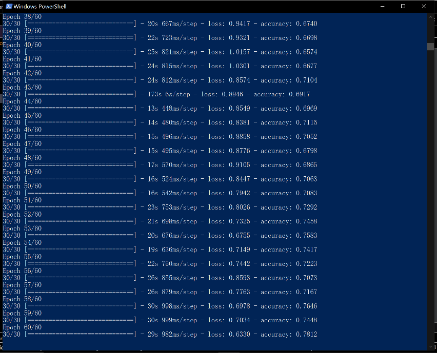
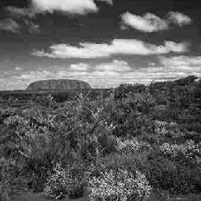
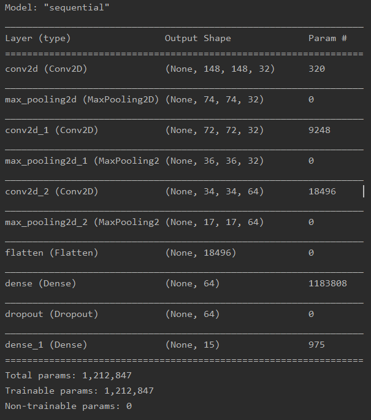
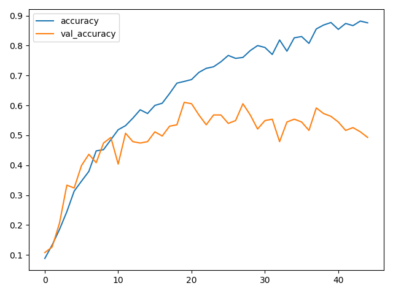

## Scenary Calssification
This task is the final work of course. We need to classify 15 category pics,
and in each category there are 100 pictures.

We use keras in Tensorflow2.0 to build our model.

### How to run it? 

train command in CMD:

```shell script
python .\scene_recog_cnn.py --phase="train" --train_data_dir=".\data\train\" --test_data_dir='.\data\test\' --model_dir='.\'
```

train command in CMD:

```shell script
python .\scene_recog_cnn.py --phase="train" --train_data_dir=".\data\train\" --test_data_dir='.\data\test\' --model_dir='.\'
```

<div align=center>

</div>

### Our procedure
**1. Dataset Clean**

The existence of dirty data often affects the classification accuracy of the model, so the first thing we do is to clean out the dirty data in the dataset provided. In fact, in our data set, many scenes have high similarity, so it is difficult to distinguish them by simple CNN, and it is even difficult for human eyes to distinguish the corresponding pictures of these scenes. For example, the image_0271.jpg in OpenCountry can also be classified as forest.

<div align=center>

</div>

**2. Data augmentation**

|  Strategy   |  Parameters |
|  ----  | ----  |
| BrightnessEnhancement  | 1.5 times |
| ContrastEnhancement  | 1.5 times |
| RandomRotation  | Randomly in [-90, +90, 180] |
| Flip  | Filp image in left and right |
	
**it will generate a new directory called "augmented" to restore augmented images**

**3. Model design**

<div align=center>

</div>

In addition, optimizer "Adam" and Loss Function "categorical_crossentropy" is recognized choice of multiple classification problems.
Besides we use dropout function to prohibit overfitting problem.


**4.	Result Analysis**

We choose 15% of our picture from dataset in each category to seperated as train_dataset and validation_dataset. Command is shown below

```shell script
python .\split_train.py --data_path "./data/train" --test_data_path "./data/test" --train_ratio 0.85
```


The final accuracy of our model can be seen as below. Here we randomly choose 15% of image as our validation data. With the procession of training, we obtained an accuracy of 93% on training set and 60% on the validation set. There are two reasons for the low accuracy of the prediction of validation set. The main reason is because the number of images of the training set is not enough, which leads to overfitting. Another reason is because of the similarity of different categories，such as forest and OpenCountry, bedroom and living room.

<div align=center>

</div>

